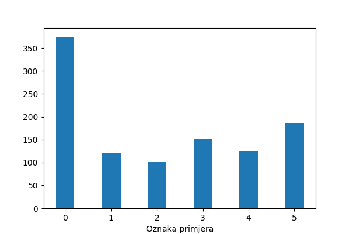
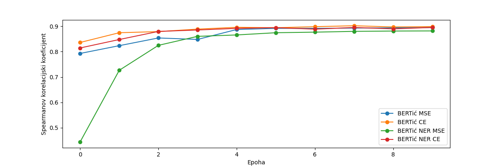

# article-bertic
The repository for an article embedding model for croatian language using a bi-encoder approach.

In addition, the repository contains the first dataset for semantic textual similarity in Croatian.

## Project notes

### Dataset creation
- sampling the articles randomly from the Retriever database and pairing them randomly doesn't work - mostly completely unrelated articles
- better approach - taking into account only the last $n$ articles by the published date since different websites cover the same news
- final sample consists of 30000 recent articles

- randomly pairing articles still doesn't work
- a better approach 
  - using BM25 to create "silver" labels
  - after calculating the BM25 scores, normalization and applying softmax with temperature probabilties are acquired
  - finally, sampling from this distribution makes for fairly correct "silver" labels
  - later, thresholding the BM25 scores w.r.t. the maximum value was done to further improve the ratio of labels

- after pairing the articles given the "silver" labels, annotation of the dataset was done

- histogram of website occurences

### Models

- unsupervised cosine similarity between some embeddings
- support vector regression using some embeddings
  - concatenatenation of the first text embedding, second text embedding and the absolute difference
  
 
| Model                                         | Training set    | Validation set      | Test set            |
| --------------------------------------------- | --------------- | ------------------- | ------------------- |
| Cosine similarity + Floret mean               | 0.693/0.528     | 0.732/0.498         | 0.722/0.634         |
| Cosine similarity + FastText mean             | 0.668/0.427     | 0.699/0.335         | 0.700/0.660         |
| Cosine similarity + BERTić mean               | 0.476/0.155     | 0.404/0.215         | 0.420/0.184         |
| Cosine similarity + BERTić NER mean           | 0.592/0.253     | 0.602/0.285         | 0.544/0.407         |
| Cosine similarity + CroSloEngual BERT mean    | **0.854**/0.813 | **0.840**/**0.808** | **0.861**/**0.837** |
| Cosine similarity + multilingual BERT mean    | 0.479/0.370     | 0.495/0.364         | 0.450/0.360         |
| Cosine similarity + XLM-RoBERTa mean          | 0.748/0.577     | 0.746/0.343         | 0.717/0.650         |
| Cosine similarity + BERTić [CLS]              | 0.632/0.368     | 0.629/0.470         | 0.685/0.618         |
| Cosine similarity + BERTić NER [CLS]          | 0.595/0.258     | 0.606/0.236         | 0.549/0.391         |
| Cosine similarity + CroSloEngual BERT [CLS]   | 0.658/0.591     | 0.675/0.572         | 0.671/0.620         |
| Cosine similarity + multilingual BERT [CLS]   | 0.275/0.015     | 0.352/0.020         | 0.174/0.005         |
| Cosine similarity + XLM-RoBERTa [CLS]         | 0.777/0.481     | 0.777/0.280         | 0.811/0.708         |
| SVM + Floret                                  | 0.840/**0.834** | 0.806/0.789         | 0.827/0.816         |
| SVM + FastText                                | 0.829/0.826     | 0.809/0.790         | 0.823/0.817         |

- cross-encoder approach using BERTić and BERTić NER using MSE and CE loss functions
- cross entropy requires scaling labels to $[0, 1]$
 
| Model                                         | Training set    | Validation set      | Test set            |
| --------------------------------------------- | --------------- | ------------------- | ------------------- |
| BERTić + MSE | 0.943/0.939 | 0.895/0.902 | 0.905/0.905 |
| BERTić + CE | **0.947**/0.975 | **0.902**/**0.923** | **0.910**/**0.936** |
| BERTić NER + MSE | 0.938/0.912 | 0.881/0.859 | 0.899/0.871 |
| BERTić NER + CE | **0.947**/**0.977** | 0.895/0.918 | 0.906/0.934 |

- validation set cross-encoder Spearman coefficient over epochs

- bi-encoder approaches using BERTić architectures and multilingual architectures

| Model                                         | Training set    | Validation set      | Test set            |
| --------------------------------------------- | --------------- | ------------------- | ------------------- |
| BERTić | 0.945/0.967 | 0.743/0.730 | 0.816/0.786 |
| BERTić NER | 0.932/0.953 | 0.771/0.748 | 0.798/0.777 |
| CroSloEngual BERT | 0.960/0.979 | 0.892/**0.901** | 0.895/0.902 |
| multilingual BERT | **0.967**/**0.991** | **0.893**/**0.901** | **0.916**/**0.921** |
| XLM-RoBERTa | 0.958/0.981 | 0.881/0.889 | 0.894/0.886 |

- validation set bi-encoder Spearman coefficient over epochs

### Time performance analysis

-  due to the representations being independent up until the cosine similarity. bi-encoders should have shorter inference times
-  mean and standard deviation in seconds for BERTić NER cross-encoder and bi-encoder multilingual BERT for 10, 100, and 1000 examples using 10 runs

 
| Model                                         | Training set    | Validation set      | Test set            |
| --------------------------------------------- | --------------- | ------------------- | ------------------- |
| Bi-encoder    | 0.00009 ± 0.00002 | 0.00177 ± 0.00242 | 0.00963 ± 0.00202 |
| Cross-encoder | 0.18913 ± 0.00231 | 1.91337 ± 0.00471 | 19.31912 ± 0.13923 |
